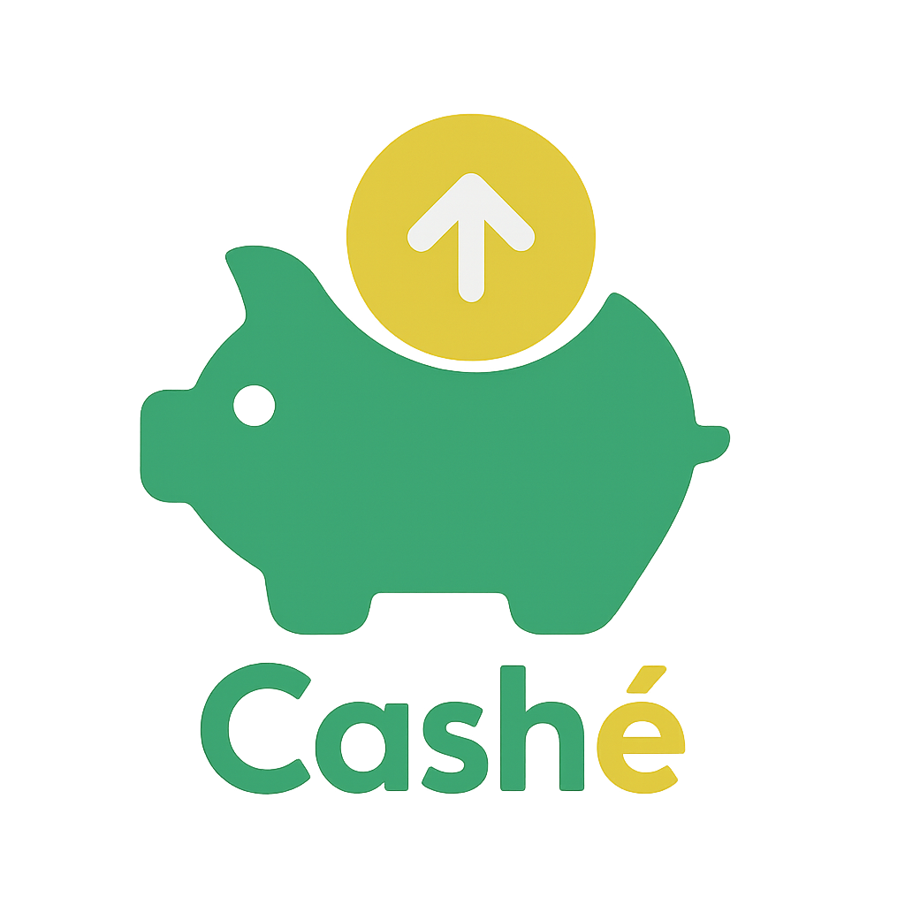

# 💰 Cashé Backend

<div align="center">
  


**Backend para la aplicación de finanzas personales Cashé**

[](https://openjdk.java.net/)
[](https://spring.io/projects/spring-boot)
[](https://www.postgresql.org/)
[](LICENSE)

**[🖥️ Frontend](https://github.com/juanmanuellosada/cashe-frontend) • [📱 Demo](https://demo.cashe.app) • [📚 Documentación](docs/)**

</div>

## Tabla de Contenidos

- [Cashé Backend](#cashé-backend)
  - [Tabla de Contenidos](#tabla-de-contenidos)
  - [Descripción](#descripción)
  - [Características Principales](#características-principales)
  - [Stack Tecnológico](#stack-tecnológico)
  - [Requisitos Previos](#requisitos-previos)
  - [Configuración del Entorno](#configuración-del-entorno)
  - [Compilar y Ejecutar](#compilar-y-ejecutar)
  - [Ejecutar Pruebas](#ejecutar-pruebas)
  - [Estructura del Proyecto](#estructura-del-proyecto)
  - [Documentación de la API (Swagger)](#documentación-de-la-api-swagger)
  - [Autenticación](#autenticación)
  - [Casos de Uso Principales](#casos-de-uso-principales)
  - [Contribución](#contribución)
  - [Licencia](#licencia)
  - [Autor](#autor)

## 📖 Descripción

Este proyecto es el **backend para Cashé**, una aplicación completa diseñada para ayudar a los usuarios a gestionar sus finanzas personales de manera eficiente. Proporciona una API RESTful robusta para todas las operaciones necesarias, desde el registro de usuarios hasta análisis financieros avanzados.

### 🔗 Ecosistema Cashé

- **Backend (este repositorio)**: API REST desarrollada con Spring Boot
- **[Frontend](https://github.com/juanmanuellosada/cashe-frontend)**: Aplicación web desarrollada con React/TypeScript
- **Base de datos**: PostgreSQL para almacenamiento robusto
- **Autenticación**: JWT y OAuth2 con Google

## Características Principales

- Gestión de usuarios (Registro, Login con Email/Contraseña y Google OAuth2)
- Autenticación basada en JWT.
- Gestión de múltiples monedas con tasas de cambio (próximamente).
- Creación y gestión de múltiples tipos de cuentas (ej. Efectivo, Banco, Inversión).
- Registro detallado de transacciones (ingresos y egresos).
- Gestión de tarjetas de crédito y débito.
- Creación de presupuestos basados en categorías.
- Transferencias entre cuentas.
- Gestión de categorías personalizadas y predefinidas/globales.
- Subida de adjuntos (recibos/facturas) para transacciones.
- Recordatorios de impuestos para tarjetas.
- Endpoints de agregación para reportes y visualizaciones (resumen por categoría, tendencias, flujo de caja, estadísticas financieras).
- API documentada con Swagger/OpenAPI.
- Manejo global de excepciones.
- Configuración para tests con base de datos en memoria H2.

## 🛠️ Stack Tecnológico

### Framework Principal

- **Java 17** - Lenguaje de programación
- **Spring Boot 3.2.x** - Framework principal
- **Spring Security** - Seguridad y autenticación (JWT y OAuth2)
- **Spring Data JPA** - Persistencia de datos (con Hibernate)

### Base de Datos

- **PostgreSQL** - Base de datos principal (desarrollo/producción)
- **H2 Database** - Base de datos en memoria (para tests)

### Herramientas y Librerías

- **Maven** - Gestor de dependencias y build
- **Lombok** - Reducción de código boilerplate
- **JJWT** - Manejo de JSON Web Tokens
- **SpringDoc OpenAPI** - Documentación automática de la API (Swagger)
- **JUnit 5 & Mockito** - Framework de testing

## Requisitos Previos

- Java JDK 17 (OpenJDK Temurin 17 recomendado).
- Apache Maven 3.6+
- PostgreSQL (versión 12+ recomendada, si se usa para desarrollo local/producción).
- (Opcional) Una herramienta de cliente API como Postman o Insomnia.
- (Opcional) Credenciales de Google Cloud Console para OAuth2 si se desea probar el login con Google.

## ⚙️ Configuración del Entorno

### 1. Clonar el Repositorio

```bash
git clone https://github.com/juanmanuellosada/cashe-backend.git
cd cashe-backend
```

### 2. Configurar Variables de Entorno

Asegúrate de tener `JAVA_HOME` configurado para tu JDK 17.

### 3. Configurar Base de Datos PostgreSQL

Crea la base de datos y actualiza las credenciales en `src/main/resources/application.properties`:

```sql
CREATE DATABASE cashe;
CREATE USER cashe_user WITH PASSWORD 'tu_contraseña_pg';
GRANT ALL PRIVILEGES ON DATABASE cashe TO cashe_user;
```

```properties
spring.datasource.url=jdbc:postgresql://localhost:5432/cashe
spring.datasource.username=cashe_user
spring.datasource.password=tu_contraseña_pg
```

### 4. (Opcional) Configurar Google OAuth2

Para habilitar el login con Google:

1. Crea un proyecto en [Google Cloud Console](https://console.cloud.google.com/)
2. Configura un ID de cliente OAuth2 para aplicación web
3. Agrega estas propiedades a `application.properties`:

```properties
spring.security.oauth2.client.registration.google.client-id=TU_GOOGLE_CLIENT_ID
spring.security.oauth2.client.registration.google.client-secret=TU_GOOGLE_CLIENT_SECRET
```

4. Configura el URI de redirección autorizado: `http://localhost:8080/login/oauth2/code/google`

## Compilar y Ejecutar

1.  Desde la raíz del proyecto, compila con Maven:
    ```bash
    mvn clean install -U
    ```
2.  Ejecuta la aplicación:
    `bash
mvn spring-boot:run
`
    O puedes ejecutar el JAR generado en `target/cashe-backend-0.0.1-SNAPSHOT.jar`:
    `bash
java -jar target/cashe-backend-0.0.1-SNAPSHOT.jar
`
    La aplicación estará disponible en `http://localhost:8080` (o el puerto configurado).

## Ejecutar Pruebas

Para ejecutar las pruebas unitarias y de integración (usando base de datos H2 en memoria):

```bash
mvn test
```

## Estructura del Proyecto

- `src/main/java/com/cashe/backend`: Código fuente principal.
  - `config`: Configuraciones de Spring (Seguridad, etc.).
  - `controller`: Controladores REST que exponen la API.
    - `advice`: Manejadores globales de excepciones.
  - `domain`: Entidades JPA y Enums.
    - `enums`: Enumeraciones específicas del dominio.
  - `repository`: Interfaces de Spring Data JPA.
    - `dto`: DTOs específicos para resultados de queries de repositorio.
  - `service`: Lógica de negocio (Interfaces e Implementaciones).
    - `dto`: Data Transfer Objects para la comunicación entre capas.
    - `mapper`: Clases para mapear entre Entidades y DTOs.
  - `common`: Clases comunes (excepciones personalizadas, DTOs de error).
- `src/main/resources`: Archivos de configuración y estáticos.
  - `application.properties`: Configuración principal de la aplicación.
  - `static/images`: Logos e imágenes de la aplicación.
- `src/test/java`: Pruebas unitarias y de integración.
- `src/test/resources`: Archivos de configuración para tests (`application-test.properties`).
- `docs/images`: Imágenes para la documentación.

## Documentación de la API (Swagger)

Una vez que la aplicación esté corriendo, la documentación interactiva de la API generada por SpringDoc OpenAPI estará disponible en:

- **Swagger UI**: [http://localhost:8080/swagger-ui.html](http://localhost:8080/swagger-ui.html)
- **OpenAPI Spec (JSON)**: [http://localhost:8080/api-docs](http://localhost:8080/api-docs)

Se recomienda explorar la UI de Swagger para entender todos los endpoints, sus parámetros, cuerpos de solicitud y respuestas esperadas.

## 🔐 Autenticación y Seguridad

La API utiliza **JSON Web Tokens (JWT)** para la autenticación. Flujo de trabajo:

### 🔑 Métodos de Autenticación

#### Registro con Email/Contraseña

```bash
POST /auth/register
Content-Type: application/json

{
  "fullName": "Juan Pérez",
  "email": "juan@ejemplo.com",
  "password": "contraseña123"
}
```

#### Login con Email/Contraseña

```bash
POST /auth/login
Content-Type: application/json

{
  "email": "juan@ejemplo.com",
  "password": "contraseña123"
}
```

**Respuesta:**

```json
{
  "accessToken": "eyJhbGciOiJIUzI1NiIsInR5cCI6IkpXVCJ9...",
  "tokenType": "Bearer",
  "user": {
    "id": 1,
    "fullName": "Juan Pérez",
    "email": "juan@ejemplo.com"
  }
}
```

#### Login con Google OAuth2

Navega a `/oauth2/authorization/google` para iniciar el flujo de OAuth2 con Google.

### 🔒 Uso de Tokens

Para acceder a endpoints protegidos, incluye el token JWT en el header `Authorization`:

```bash
Authorization: Bearer <tu_access_token>
```

### 🛡️ Niveles de Protección

- **Endpoints públicos**: `/auth/**`, `/actuator/health`
- **Endpoints autenticados**: `/api/**` (requieren token JWT válido)
- **Endpoints administrativos**: Algunos endpoints requieren roles específicos

## Casos de Uso Principales

- **Registro y Autenticación de Usuarios**: Los usuarios pueden crear cuentas y acceder de forma segura mediante email/contraseña o Google.
- **Gestión de Perfil**: Los usuarios pueden ver y actualizar su información de perfil (nombre, moneda por defecto, idioma) y cambiar su contraseña.
- **Gestión de Monedas**: (Administrativo) Creación y gestión de monedas y sus tasas de cambio.
- **Gestión de Tipos de Cuenta**: Los usuarios pueden usar tipos de cuenta predefinidos y crear los suyos propios.
- **Creación y Gestión de Cuentas**: Los usuarios pueden crear múltiples cuentas (bancarias, efectivo, inversión) en diversas monedas, ver sus saldos y transacciones.
- **Registro de Transacciones**: Se pueden registrar ingresos y egresos detallados, asignándolos a cuentas o tarjetas, categorías, y adjuntar recibos.
- **Gestión de Tarjetas**: Los usuarios pueden añadir y gestionar sus tarjetas de crédito/débito, incluyendo límites de crédito y fechas de ciclo.
- **Transferencias**: Realizar transferencias de fondos entre cuentas propias.
- **Presupuestos**: Crear presupuestos (mensuales, semanales, etc.) basados en categorías para controlar los gastos y ver el progreso.
- **Categorización**: Usar categorías globales/predefinidas o crear categorías personalizadas para organizar las transacciones.
- **Recordatorios de Impuestos**: Configurar recordatorios para impuestos o cargos recurrentes asociados a tarjetas.
- **Reportes y Estadísticas**:
  - Obtener resúmenes de gastos/ingresos por categoría en un rango de fechas.
  - Ver tendencias de gastos/ingresos a lo largo del tiempo (diario, mensual, anual).
  - Analizar el flujo de caja mensual o anual.
  - Obtener estadísticas financieras generales (ingresos/egresos totales, ahorros, promedios).

## 🤝 Integración Frontend-Backend

Este backend está diseñado para trabajar en conjunto con el **[Frontend de Cashé](https://github.com/juanmanuellosada/cashe-frontend)** desarrollado en React/TypeScript.

### 🔗 Configuración de CORS

El backend está configurado para aceptar peticiones desde el frontend:

```properties
# Configuración de CORS para desarrollo local
cors.allowed-origins=http://localhost:3000,http://localhost:5173
```

### 📡 Endpoints Principales para el Frontend

| Método | Endpoint            | Descripción                     |
| ------ | ------------------- | ------------------------------- |
| `GET`  | `/api/accounts`     | Lista de cuentas del usuario    |
| `GET`  | `/api/transactions` | Transacciones con filtros       |
| `POST` | `/api/transactions` | Crear nueva transacción         |
| `GET`  | `/api/budgets`      | Presupuestos del usuario        |
| `GET`  | `/api/categories`   | Categorías disponibles          |
| `GET`  | `/api/analytics/*`  | Análisis y reportes financieros |

### 🚀 Despliegue Conjunto

- **Frontend**: Desplegado en Vercel/Netlify
- **Backend**: Desplegado en Railway/Heroku
- **Base de datos**: PostgreSQL en la nube

## 🏃‍♂️ Inicio Rápido

### Para Desarrolladores Frontend

Si ya tienes el frontend corriendo, solo necesitas:

```bash
# 1. Clonar y configurar el backend
git clone https://github.com/juanmanuellosada/cashe-backend.git
cd cashe-backend

# 2. Configurar base de datos (ver sección de configuración)

# 3. Ejecutar el backend
mvn spring-boot:run
```

El backend estará disponible en `http://localhost:8080` y listo para recibir peticiones del frontend.

## 🤝 Contribución

¡Las contribuciones son bienvenidas! Si quieres contribuir al proyecto:

### 📋 Pasos para Contribuir

1. **Fork** el proyecto
2. Crea una **rama** para tu feature (`git checkout -b feature/nueva-funcionalidad`)
3. **Commit** tus cambios (`git commit -m 'Agregar nueva funcionalidad'`)
4. **Push** a la rama (`git push origin feature/nueva-funcionalidad`)
5. Abre un **Pull Request**

### 🎯 Estándares de Código

- Seguir las convenciones de **Java** y **Spring Boot**
- Usar **Lombok** para reducir código boilerplate
- Documentar métodos públicos con **JavaDoc**
- Escribir tests para nuevas funcionalidades
- Mantener cobertura de tests > 80%

### 🐛 Reportar Bugs

Usa el sistema de [Issues de GitHub](https://github.com/juanmanuellosada/cashe-backend/issues) para reportar bugs o solicitar nuevas funcionalidades.

## 📄 Licencia

Este proyecto está bajo la **Licencia MIT**. Ver el archivo [LICENSE](LICENSE) para más detalles.

## 👨‍💻 Autor

**Juan Manuel Losada**

- 🐙 GitHub: [@juanmanuellosada](https://github.com/juanmanuellosada)
- 📧 Email: [contacto@ejemplo.com](mailto:juanmalosada01@gmail.com)
- 💼 LinkedIn: [Juan Manuel Losada](https://www.linkedin.com/in/juanmanuel-losada/)

## 🙏 Agradecimientos

- [Spring Framework](https://spring.io/) por proporcionar un excelente ecosistema de desarrollo
- [PostgreSQL](https://www.postgresql.org/) por ser una base de datos robusta y confiable
- [JWT.io](https://jwt.io/) por el estándar de tokens de autenticación
- La comunidad de desarrolladores Java y Spring Boot
- Todos los colaboradores que hacen posible este proyecto

---

<div align="center">
  
**¿Te gusta el proyecto? ¡Dale una ⭐ en GitHub!**

[🖥️ Ver Frontend](https://github.com/juanmanuellosada/cashe-frontend) | [📚 Documentación](docs/) | [🐛 Reportar Bug](https://github.com/juanmanuellosada/cashe-backend/issues)

</div>
